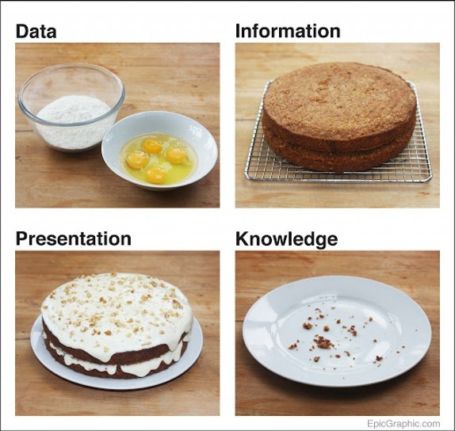
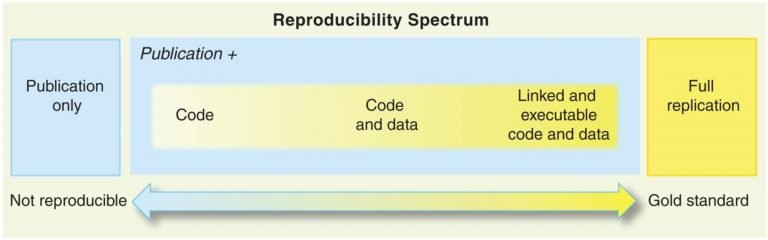

layout: true

 

---

# Learning objectives

**About today:**

- Understand what you can gain from analysis reproducibility. 

- Know what the main technical requirements are to set up for their analysis to be reproducible. 

- Have a demonstration of a practical way to make a cake using household survey data: crunching, analysis & interpretation & data stories! 

**Not today:**

- Training on R language!

???
Have you ever completed the development of a data product with the feeling that you may have done a mistake or not have used the optimal way to clean or process your data?  

As an analyst, if using “point & click” interface, “rewinding” all the steps at an advanced stage of the development of your product can be extremely painful and lengthy. Errare humanum est sed perseverare... If you want to learn from your mistake rather than to suffer from them, then analysis reproducibility is what you need... 

In this session, we will introduce you to the basics of analysis reproducibility and explain you what elements you need to watch for when you kick start your analysis so that you can always rewind and improve any products you have already spent time on. We will also show you how you can learn from analysis done in a reproducible way done by other colleagues. 

We will also show you through practical examples how to implement a fully reproducible data analysis workflow applied to a Household Survey dataset using R statistical Language: from initial data exploration to joint interpretation till the creation of data stories.  

Last, we hope that this session will motivate you to join the vibrant R users community in UNHCR and soon become an R champion. In order to make the most of the session, we would advise you to install the following open source environment: 

    R - https://cran.r-project.org/bin/windows/base/ 

    Rstudio Free version: https://www.rstudio.com/products/rstudio/download/ 

    Create an account on Github - https://github.com/join?  and install Github desktop https://desktop.github.com/ 

You may also start installing UNHCR Packages – following the instruction in their respective documentation published on Github: 

    Use UNHCR Open data  - https://unhcr.github.io/unhcrdatapackage/docs/  

    API to connect to internal data source - https://unhcr-web.github.io/hcrdata/docs/ 

    Perform High Frequency Check https://unhcr.github.io/HighFrequencyChecks/docs/ 

    Process data crunching for survey dataset - https://unhcr.github.io/koboloadeR/docs/  

    Use UNHCR graphical template- https://unhcr-web.github.io/unhcRstyle/docs/ 

Last, you may also take advantage of going through one or more of the R learning content on Learn & Connect: Achieve your potential: UNHCR (csod.com)  and see some practical tutorial on https://humanitarian-user-group.github.io/  

The best way to start and learn is to have a concrete project! If you have one and need mentoring, we can liaise after the session. 

---

## Vision

"Multi-functional teams, with strengthened data literacy, regularly conduct meaningful and documented joint data interpretation sessions to define their strategic directions based on statistical evidences" 

---

## A _Theory of Change_ for Data analysis

### Proper user of data for advocacy & programmatic decision making

- Corporate Standards exist to define how to encode & process household surveys dataset
- Field data experts are trained based on precise recipes and predefined tools at each step of the data life cycle
- Data are presented, discussed and linked to expert knowledge during data interpretation sessions with a multi-functional team 
- All potential valid Interpretations, including diverging views, are systematically recorded
- Persuasive "Data Stories“ and Policy papers are generated

---

## Data Science is like cooking

.pull-left[

Ingredients

Recipes
Decoration

]

.pull-right[

.img75[] 
]

---

class: center, middle, inverse

# Why do you need to work in a reproducible way? 

### Science, Ethics, Productivity, Learning

---

## Science

Promoting scientific transparency in analysis​: the 4 Mertonian norms (often abbreviated as the CUDO-norms

.img[] 

???
thical principles into algorithmic design - would apply as well when designing household vulnerability scoring formula to inform humanitarian targeting
https://www.hum-dseg.org/sites/default/files/2020-10/Framework%20for%20the%20ethical%20use.pdf

---

## Ethics of science

.pull-left[
Merthonian norm

]
.pull-right[
.img75[] 
]

???
thical principles into algorithmic design - would apply as well when designing household vulnerability scoring formula to inform humanitarian targeting
https://www.hum-dseg.org/sites/default/files/2020-10/Framework%20for%20the%20ethical%20use.pdf
---

## Productivity  

.pull-left[

The force of automation: creating functions & scripts
]
.pull-right[
.img75[] 
]

---

## Learning

.pull-left[
by doing
though peer review

]
.pull-right[
.img75[] 
]

---

class: center, middle, inverse

# Conditions for reproducibility. 

### Curated source, packages, documentation

---

## Curated source

.pull-left[
there's no clean data

]
.pull-right[
.img75[] 
]

---

## packages  

.pull-left[

Making your function re-usable
]
.pull-right[
.img75[] 
]

---

## documentation

.pull-left[
Explain what you do

]
.pull-right[
.img75[] 
]

---
class: center, middle, inverse

# Hands-on practice: a practical run-through based on Household survey dataset

### Crunching, Interpretation, Dissemination

---

## Automatic Data exploration  

.pull-left[
Data crunching

]
.pull-right[
.img75[] 
]

???
A comparison of packages for Automated Exploratory Data Analysis 
https://arxiv.org/pdf/1904.02101.pdf
https://github.com/mstaniak/autoEDA-resources

---

## Insight creation

.pull-left[
Joint Data interpration
from assumption on key question to evidence based statement

]
.pull-right[
.img75[] 
]
???
https://www.ictworks.org/wp-content/uploads/2021/02/usaid-guide-artificial-intelligence.pdf
---

## Communicate with data
.pull-left[
Microsite

]
.pull-right[
.img75[] 
]

???
https://distill.pub/2020/communicating-with-interactive-articles/#applications-tab 
Research Dissemination
Conducting novel research requires deep understanding and expertise in a specific area. Once achieved, researchers continue contributing new knowledge for future researchers to use and build upon. Over time, this consistent addition of new knowledge can build up, contributing to what some have called research debt. Not everyone is an expert in every field, and it can be easy to lose perspective and forget the bigger picture. Yet research should be understood by many. Interactive articles can be used to distill the latest progress in various research fields and make their methods and results accessible and understandable to a broader audience.
Opportunities

    Engage and excite broader audience with latest research progress
    Remove research debt, onboard new researchers
    Make faster and clearer research progress 

Challenges

    No clear incentive structure for researchers
    Little funding for bespoke research dissemination and communication
    Not seen as a legitimate research contribution (e.g., to the field, or one's career) 

---

class: center, middle, inverse

# Conclusion 

### Learn, Join, Maintain

---

## Learn

.img80[] 
]

---

## Community
.pull-left[
Microsite

]
.pull-right[
.img75[] 
]

---

## Multi Tier Support
.pull-left[
Microsite

]
.pull-right[
.img75[] 
]

---