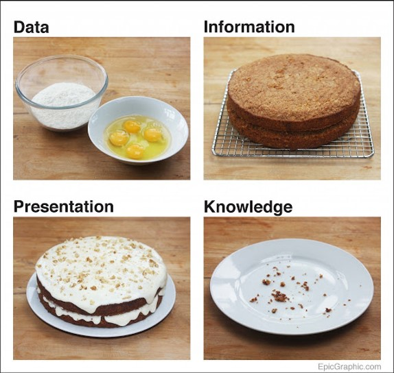
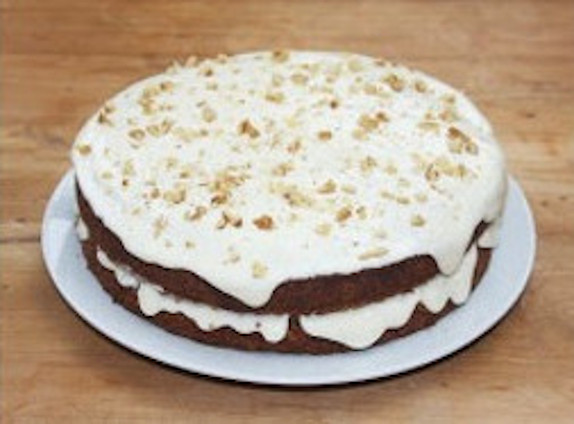
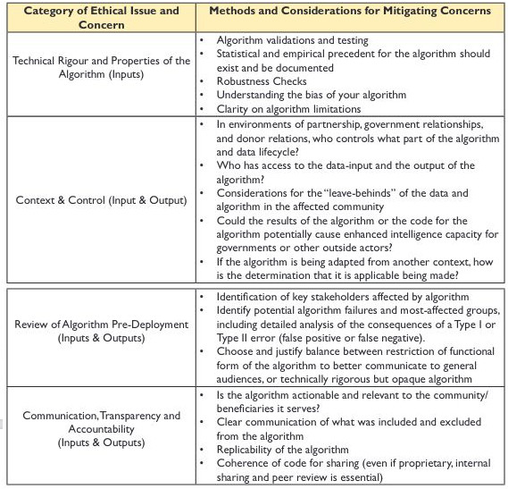
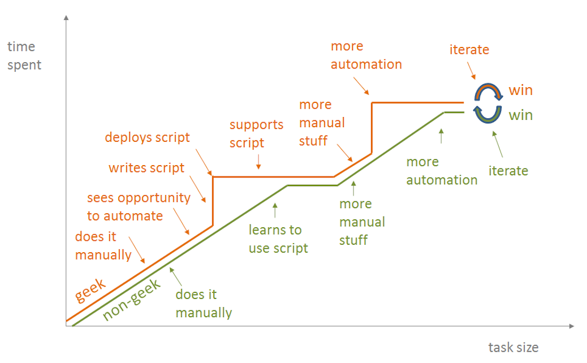
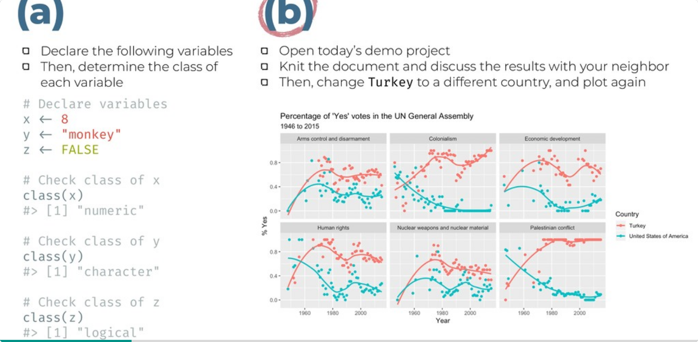
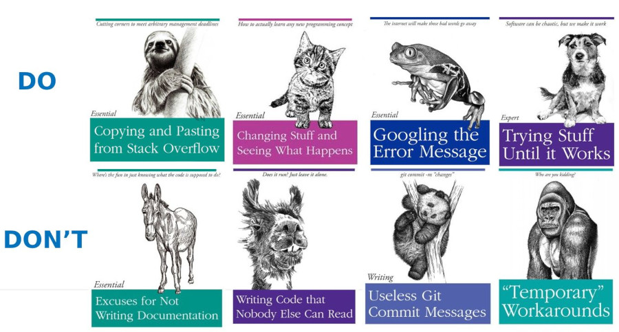
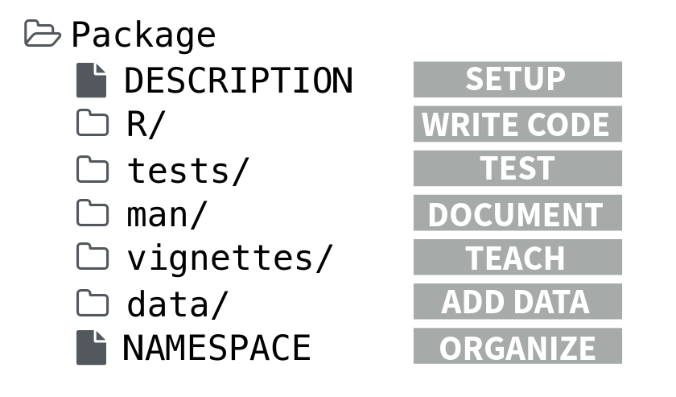
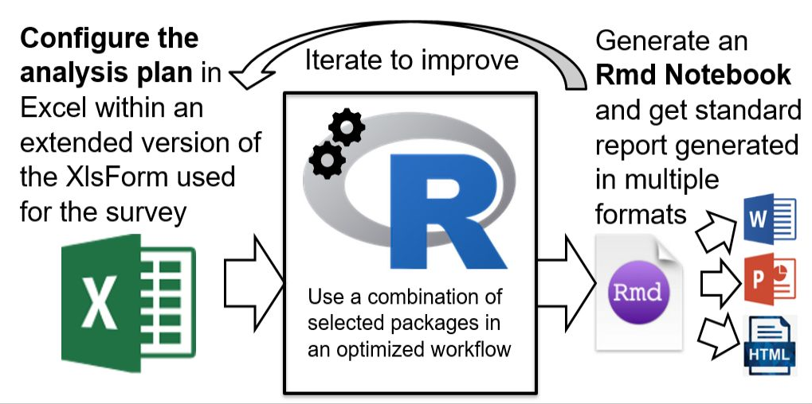
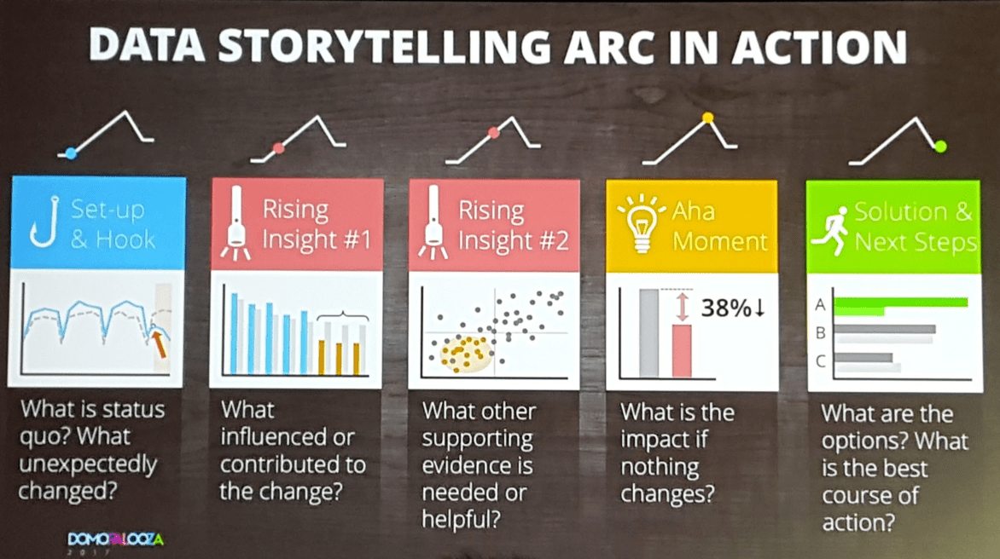
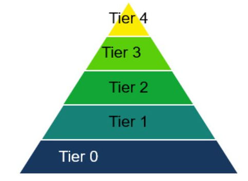

layout: true

<div class="my-footer"><span></span></div> 

---

# Objectifs d'apprentissage

**À propos d'aujourd'hui:**

- Comprendre ce que vous pouvez gagner de la reproductibilité de l'analyse.

- Connaître les principales exigences techniques à mettre en place pour qu'une analyse soit reproductible.

- Démonstration d'une manière pratique de faire un gâteau en utilisant les données d'une enquête auprès des ménages : analyse et interprétation et "data story" !

**Pas pour aujourd'hui:**

- Formation d'initiation au langage R ! Pour cela, dirigez-vous vers [Formation UNHCR Learn & Connect-R](https://unhcr.csod.com/ui/lms-learner-playlist/PlaylistDetails?playlistId=e90e2279-e3a4-4ef2-8b74-757f91d224b2)

???
Avez-vous déjà terminé le développement d'un produit de données avec le sentiment d'avoir fait une erreur ou de ne pas avoir utilisé la méthode optimale pour nettoyer ou traiter vos données ?

En tant qu'analyste, si vous utilisez l'interface " pointer-cliquer ", " rembobiner " toutes les étapes à un stade avancé du développement de votre produit peut être extrêmement pénible et long. Errare humanum est sed perseverare... Si vous voulez apprendre de vos erreurs plutôt que d'en souffrir, alors la reproductibilité des analyses est ce qu'il vous faut...

Au cours de cette session, nous vous présenterons les bases de la reproductibilité de l'analyse et vous expliquerons quels éléments vous devez surveiller lorsque vous démarrez votre analyse afin que vous puissiez toujours revenir en arrière et améliorer les produits sur lesquels vous avez déjà passé du temps. Nous vous montrerons également comment vous pouvez apprendre de l'analyse effectuée de manière reproductible par d'autres collègues.

Nous vous montrerons également à travers des exemples pratiques comment mettre en œuvre un flux de travail d'analyse de données entièrement reproductible appliqué à un ensemble de données d'enquête auprès des ménages à l'aide du langage statistique R : de l'exploration initiale des données à l'interprétation conjointe jusqu'à la création d'histoires de données.

Enfin, nous espérons que cette session vous motivera à rejoindre la communauté dynamique des utilisateurs de R au HCR et à devenir bientôt un champion de R. Afin de profiter au mieux de la session, nous vous conseillons d'installer l'environnement open source suivant :

    R - https://cran.r-project.org/bin/windows/base/

    Rstudio Version gratuite : https://www.rstudio.com/products/rstudio/download/

    Créez un compte sur Github - https://github.com/join? et installez le bureau Github https://desktop.github.com/

Vous pouvez également commencer à installer les packages UNHCR - en suivant les instructions de leur documentation respective publiée sur Github :

    Utiliser les données ouvertes du HCR - https://unhcr.github.io/unhcrdatapackage/docs/

    API pour se connecter à la source de données interne - https://unhcr-web.github.io/hcrdata/docs/

    Effectuer un contrôle haute fréquence https://unhcr.github.io/HighFrequencyChecks/docs/

    Traitement des données pour l'ensemble de données d'enquête - https://unhcr.github.io/koboloadeR/docs/

    Utilisez le modèle graphique du HCR - https://unhcr-web.github.io/unhcRstyle/docs/

Enfin, vous pouvez également profiter d'un ou plusieurs contenus d'apprentissage R sur Learn & Connect: Achieve your potential: UNHCR (csod.com) et voir un tutoriel pratique sur https://humanitarian-user-group.github .io/

La meilleure façon de commencer et d'apprendre est d'avoir un projet concret ! Si vous en avez un et avez besoin d'un mentorat, nous pouvons assurer la liaison après la session.

---


## Une vision pour l'analyse des données

<span style='font-size:50px; color:grey ;'>"Des équipes multifonctionnelles, dotées d'une maîtrise des données renforcée, mènent régulièrement des sessions conjointes d'interprétation de données documentées pour définir leurs orientations stratégiques sur la base de preuves statistiques"</span>

---

## Théorie du changement: analyse de données

<span style='font-size:30px;'>Utilisateur approprié des données pour le plaidoyer et la prise de décision programmatique </span>

 <span style='font-size:40px;'>&#8618;</span> Des __standards__ organisationels existent pour définir comment encoder et traiter l'ensemble de données des enquêtes auprès des ménages
 
  <span style='font-size:40px;'>&#8618;</span> Les experts en données de terrain sont formés sur la base de recettes précises et d'outils prédéfinis à chaque étape du __cycle de vie des données__
  
 <span style='font-size:40px;'>&#8618;</span> Les données sont présentées, discutées et liées aux connaissances d'experts lors de sessions d'__interprétation__ de données avec une équipe multifonctionnelle
 
 <span style='font-size:40px;'>&#8618;</span> Toutes les interprétations valides potentielles, y compris les vues divergentes, sont systématiquement __enregistrées__
 
 <span style='font-size:40px;'>&#8618;</span> __Persuation__ Des " data stories" et des notes d'analyse de politiques publiques sont générés


---

## La science des données, c'est comme la cuisine

.pull-left[

Quand un chef commence avec un nouveau plat...

 - Hypothèses de Dégustation - Poser les bonnes questions
 
 - Ingrédients = source des Données
 
 - Lavez votre nourriture = nettoyez vos données
 
 - Ingénierie des saveurs = créer des variables calculées et dérivées
 
 - Goûter et explorer = remodeler & visualiser les données
 
 - Ajuster votre four = modélisation statistique
 
 - Art de la mise en form = utiliser la marque de style
 
 - Documentez votre recette = ajoutez des commentaires techniques
]

.pull-right[

.img85[]
]

???
https://towardsdatascience.com/data-science-explained-with-cooking-1a801731d749

https://towardsdatascience.com/5-reasons-why-data-science-is-like-cooking-daa506b4166a

Sans de bons ingrédients, vous ne pouvez pas cuisiner un bon plat.
La plupart du temps et des efforts sont consacrés au nettoyage et à la préparation des ingrédients.
Différents outils et techniques sont nécessaires pour différentes recettes.
La cuisine est à la fois une science et un art.
On ne peut pas devenir un grand cuisinier du jour au lendemain.

---

## Information Anxiété & Analyse paralysie

<span style='font-size:30px;'> _Quand les gens ne veulent pas manger de gâteau..._ </span>

.pull-left[

Source potentielle de réticence...

 * Je ne sais pas comment le manger : je vois tous ces éléments dessus sans pouvoir comprendre pourquoi ils y ont été ajoutés et comment cela fonctionne...
 
 * Je ne fais pas confiance à ce gâteau : Comment a-t-il été créé ? As-tu bien suivi la recette ? Les ingrédients étaient-ils frais ? Puis-je faire confiance à la façon dont vous vous êtes procuré les ingrédients?
 
 * Ce n'est pas le gâteau dont j'ai besoin ! Il a l'air trop lourd & trop gros : je ne pourrai pas le digérer...
 
 * Je n'ai pas faim et je ne sais même pas quel gâteau je veux...

]
.pull-right[
.img[]
]
 
???
visualisation de données simple pour la prise de décision ou interprétation de modèles complexes pour la construction de connaissances

--- 
.pull-left[

## Produits de données : quand quoi ?

<span style='font-size:30px;'> Les tableaux de bord sont pertinents pour afficher les KPI ! (_comme quand vous conduisez votre voiture..._)</span>

> Les indicateurs clés de performance (KPI) sont des indicateurs spécifiquement conçus pour montrer les progrès vers un résultat attendu, c'est-à-dire un __cible__ prédéfini

> Créer une base analytique pour la __prise de décision__, i.e. Business Intelligence

> Aidez à attirer l'attention de la direction Snr sur ce qui compte le plus - un bon tableau de bord doit être __concis__ 
]
.pull-right[ 


```{r echo=FALSE, out.width='100%',  message=FALSE, warning=FALSE}
#install.packages('DiagrammeR')
# /* https://mermaid-js.github.io/mermaid/#/flowchart */
# https://mermaid-js.github.io/mermaid-live-editor/edit
# https://mermaid-js.github.io/mermaid/#/flowchart?id=styling-and-classes
# https://bookdown.org/yihui/rmarkdown-cookbook/diagrams.html
# library(DiagrammeR)
# mermaid("dataproduct.mmd")

library("DiagrammeR")

grViz(" 
  digraph CFA {
  
    # direction of flowchart left to right      
    graph[layout = dot, # neato|dot|twopi|circo|twopi
          #rankdir = LR, 
          label= '', 
          fontsize= 135] 

    # Decision 
    node [shape = oval, fontname = Lato, fontsize= 150, margin=1]
    X [label = 'Building a data product']; 
    
    # Decision 
    node [shape = diamond, 
          style = filled,
          color =  Gold, 
          fillcolor = Gold, 
          fontname = Lato, 
          fontsize= 135]
    a [label = 'Need to display\\n Key Performance\\n Indicators (KPI)?']; 
    b [label = 'Basic\\n Statistics?']; 
    c [label = 'Polished visuals with\\n  brand style?']; 
    d [label = 'Satistical Modeling \\n Machine Learning?']; 
    e [label = 'Quick processing \\n is critical ?']; 
    f [label = 'Need for \\n Interactivity ?']; 

    # Choices
    node [shape = box, 
          style = filled,
          fillcolor = Lavender, 
          fontname = Lato, 
          fontsize= 160] 
    1 [label = 'Dashboard  \\n with PowerBI', 
             constraint = false , margin=1.5 ];
    2 [label = 'Notebook \\n with Rmd ', margin=1.5];
    3 [label = 'Application\\n  with Python', margin=1.5];
    4 [label = 'Interface\\n with R-Shiny', margin=1.5];

    # Connect nodes with edges and labels
    X -> a [label = 'Start', fontsize= 130, penwidth = 15] 
    a -> 1 [label = 'Yes', fontsize= 130, penwidth = 15]  ## PowerBI
    a -> b [label = 'No', fontsize= 130, penwidth = 15]  ## Continue
    
    ## Basic stat
    b -> c [label = 'Yes', fontsize= 130, penwidth = 15] 
    b -> d  [label = 'No', fontsize= 130, penwidth = 15]
    
    ## Polished visuals
    c -> 2 [label = 'Yes', fontsize= 130, penwidth = 15]
    c -> e [label = 'No', fontsize= 130, penwidth = 15]
    
    ## Machine learning
    d -> e [label = 'Yes', fontsize= 130, penwidth = 15]
    d -> 2 [label = 'No', fontsize= 130, penwidth = 15]
    
    ## Quick processing
    e -> 3 [label = 'Yes', fontsize= 130, penwidth = 15]
    e -> f [label = 'No', fontsize= 130, penwidth = 15]
    
    ## Interactivity
    f -> 4 [label = 'Yes', fontsize= 130, penwidth = 15]
    f -> 2 [label = 'No', fontsize= 130, penwidth = 15]
  }

")
```


]


???
 
---

class: center, middle, inverse

# Pourquoi devons-nous travailler de manière reproductible ?

### Éthique, Productivité, Apprentissage


---

## Éthique : la science est « _montrez-moi_ » - pas « _faites-moi confiance_ »
.pull-left[

<span style='font-size:30px;'>La reproductibilité permet l'__examen par les pairs__</span>
 

 
 
 L'examen par les pairs permet la __transparence__
 
 La transparence permet __contrôle__
 
 
 Le contrôle permet la __responsabilité__
 
 > _C'est bien de faire des erreurs, tant qu'on peut les détecter et qu'on peut en tirer des leçons..._

]
.pull-right[
.img60[]
]

???
Principes éthiques dans la conception algorithmique - s'appliqueraient également lors de la conception d'une formule de notation de la vulnérabilité des ménages pour informer le ciblage humanitaire - https://www.hum-dseg.org/sites/default/files/2020-10/Framework%20for%20the%20ethical %20use.pdf

---

## Productivité : faire avancer les choses rapidement et en toute sécurité !

.pull-left[

<span style='font-size:30px;'>L'automatisation via des fonctions et des scripts peut aider à sauter des __tâches répétitives__</span>

> Les tâches qui impliquent des __manipulations de données__ récurrentes sont entreprises par des équipes...
> .. mais tout le monde dans l'équipe n'a pas besoin d'être un __geek/coder__ !

Lorsqu'un investissement suffisant peut être fait, une __Interface utilisateur graphique__ (GUI) peut être développée pour des fonctions spécifiques afin de faciliter la courbe d'apprentissage des nouveaux utilisateurs pendant qu'ils sont encore en train de développer leurs compétences  personnelles en R.

]
.pull-right[
.img130[] 
]
???
https://blog.jonudell.net/2012/01/09/another-way-to-think-about-geeks-and-repetitive-tasks/

---

## Une Communité R tournée vers l'apprentissage

.pull-left[

Quelle approche est l'exercice le plus attrayant parmi les 2 proposés à part ?!!

<span style='font-size:40px;'>Commencez à partir d'un produit final et faire __reverse engineering__ !</span>

Mangez le gâteau d'abord! (puis jouez avec et changez les ingrédients...)
]
.pull-right[
.img[]
]
???
https://speakerdeck.com/player/078592d490ae459790af7e77695fafcf?title=false&skipResize=true

---

class: center, middle, inverse

# Conditions de reproductibilité.

### Données d'approvisionnement, analyse de la documentation et sortie d'emballage

---

## Préparation des données

.pull-left[
le "Data Wrangling" prend généralement plus de 80% du temps de tout projet de données...

Imaginez si vous avez besoin de revenir en arrière dans votre analyse...

Corrigez à toutes les étapes du processus et réexécutez tout.

]
.pull-right[
.img[]
]


---

## Documenter l'analyse

.img[]

---

## de Fonctions jusqu'au package

.pull-left[

Automatisation progressive

 * niveau 1 : écrire une commande
 * niveau 2: organiser plusieurs commandes ensemble en fonction réutilisable
 * Niveau 3 : organiser plusieurs fonctions ensemble dans un package
 * Niveau 4: comprend les données de test et la documentation
 * Niveau 5 : <span style='font-size:30px;'>Tests unitaires, alias revue de code</span>
 * Niveau 5 : <span style='font-size:30px;'>Interface utilisateur graphique (GUI)</span>
]
.pull-right[
.img75[]
]


---
class: center, middle, inverse

# Excercise pratique : données d'enquête auprès des ménages

### Décryptage, interprétation et diffusion

---

## Étape 1 - Notebook pour l'exploration automatique des données, alias "crunching"


.img75[]


???
Une comparaison des packages pour l'analyse exploratoire automatisée des données
https://arxiv.org/pdf/1904.02101.pdf
https://github.com/mstaniak/autoEDA-resources

L'un des inconvénients les plus importants de PowerBI est qu'il est en lecture seule. En tant qu'utilisateur, vous ne pouvez pas utiliser de graphiques/tableaux pour prendre des décisions et les enregistrer directement dans une base de données. De plus, PowerBI n'a pas de code source accessible. Vous ne pouvez modifier les champs qu'en mode WYSIWYG, ce qui rend PowerBI facile à démarrer mais difficile à maintenir. L'absence de code source rend presque impossible un contrôle de version approprié, un test automatique de la logique ou une collaboration sur de grands projets. https://appsilon.com/powerbi-vs-r-shiny/


Avantages de Power BI - Filtrage croisé

Avantages de RStudio -
 - Éditeur visuel pour les documents R Markdown
 - Exécution de code en ligne à l'aide de blocs
 - Progiciels statistiques sophistiqués
 - Prend en charge Rcpp, python et SQL
 - Peut être thématique
 - Support graphique en ligne
 - Support latex


Qu'est-ce que RStudio ?
Un environnement de développement intégré pour R, avec une console, un éditeur de coloration syntaxique qui prend en charge l'exécution directe de code. Publiez et distribuez des produits de données dans toute votre organisation. Déploiement en un seul bouton d'applications Shiny, de rapports R Markdown, de Jupyter Notebooks, etc. Collections de fonctions R, de données et de code compilé dans un format bien défini. Vous pouvez étendre les types d'analyses que vous effectuez en ajoutant des packages.


Vous pouvez utiliser le script R avec Power BI de plusieurs manières. Les principaux incluent :

 - Source de données - élargir la gamme de sources de données disponibles, fournir une logique de traitement des données au stade de l'importation
 - Script de traitement - enrichir les capacités de traitement des données et les fonctionnalités d'ingénierie
 - Visualisation - étendre la gamme de visualisations disponibles dans R et implémenter 
---

## Étape 2 - Documentation Notebook for Data Insights : Analysis Repo

.pull-left[

> Insight : La capacité d'acquérir une compréhension précise et profonde de quelqu'un ou de quelque chose

Tous les graphiques n'émuleront pas le besoin d'interprétation - l'analyste de données doit générer celui qui peut créer des __débats__.

Les graphiques doivent être __fabriqués__ - par exemple, utilisez le titre du graphique encadré comme "question d'ouverture"...

Seule une équipe multifonctionnelle est capable d'expliquer des __motifs inattendus__, de remettre en cause ou de réviser des __hypothèses existantes__, ou d'identifier des preuves justifuant un __Appel à l'action__.

]
.pull-right[
.img[]
]

???
https://www.ictworks.org/wp-content/uploads/2021/02/usaid-guide-artificial-intelligence.pdf
https://bluemoondigital.co/our-blog/5-elements-storytelling-data/


---

## Étape 3- Notebook pour communiquer avec les données : Microsite
.pull-left[
<span style='font-size:30px;'>D'une __hypothèses vers une déclaration fondée sur des preuves__</span>

Les données doivent soutenir Narrative - et non l'inverse !

Tirez parti de la narration avec des données pour :
 * __Expliquer__,
 * __Éclairer__,
 * __Engager__


]
.pull-right[
.img75[]
]

???


https://distill.pub/2020/communicating-with-interactive-articles/#applications-tab
Diffusion de la recherche
Mener de nouvelles recherches nécessite une compréhension et une expertise approfondies dans un domaine spécifique. Une fois cet objectif atteint, les chercheurs continuent d'apporter de nouvelles connaissances que les futurs chercheurs pourront utiliser et exploiter. Au fil du temps, cet ajout constant de nouvelles connaissances peut s'accumuler, contribuant à ce que certains ont appelé la dette de recherche. Tout le monde n'est pas expert dans tous les domaines, et il peut être facile de perdre la perspective et d'oublier la situation dans son ensemble. Pourtant, la recherche doit être comprise par beaucoup. Les articles interactifs peuvent être utilisés pour distiller les derniers progrès dans divers domaines de recherche et rendre leurs méthodes et leurs résultats accessibles et compréhensibles à un public plus large.
Opportunités

    Engager et exciter un public plus large avec les derniers progrès de la recherche
    Supprimer la dette de recherche, intégrer de nouveaux chercheurs
    Faire progresser la recherche plus rapidement et plus clairement

Défis

    Pas de structure d'incitation claire pour les chercheurs
    Peu de financement pour la diffusion et la communication de la recherche sur mesure
    Non considéré comme une contribution légitime à la recherche (par exemple, sur le terrain ou à sa carrière)

---

class: center, middle, inverse

# Conclusion

---

## R en contexte humanitaire
.pull-left[

<span style='font-size:50px;'>Vous n'êtes pas seul</span>

> Plus de 450 utilisateurs de plusieurs organisations dans le [humanitarian-useR-group](https://humanitarian-user-group.github.io/)

> Environ déjà ≈20 R champions au sein de l'UNHCR contre plus de 420 utilisateurs de PowerBI Pro

> Essayez de commencer en utilisant les packages UNHCR existants et partez d'un projet que vous pouvez reproduire

]
.pull-right[
.img[]
]

---

## Un appel à l'institutionnalisation
.pull-left[

Utilisation du modèle de support informatique standard à plusieurs niveaux...
 
  * Niveau 4 : Examen du code et assurance qualité / Entreprise sous contrat avec un accord-cadre mondial

  * Niveau 3 : Développement de packages internes / Équipe de champions R internes (coût : une réunion Rdev annuelle pour inciter le personnel contributeur)

  * Niveau 2 : Induction des utilisateurs & Support utilisateur avancé / Global Data Service/DIMA (Data Science Team)

  * Niveau 1 : Dépannage de base de l'utilisateur/Centre de services mondial (WIPRO selon le scénario documenté)

  * Niveau 0 : Auto-support / Documentation du package (maintenue et améliorée en continu)

]
.pull-right[
.img75[]
]

---

## Votre opinion compte

<span style='font-size:80px;'>
Veuillez [remplir ce sondage](https://enketo.unhcr.org/single/bac3b19c91c4e5f22f4fa409bc618119) pour partager votre opinion et vos réflexions sur le sujet présenté ici

 </span> 